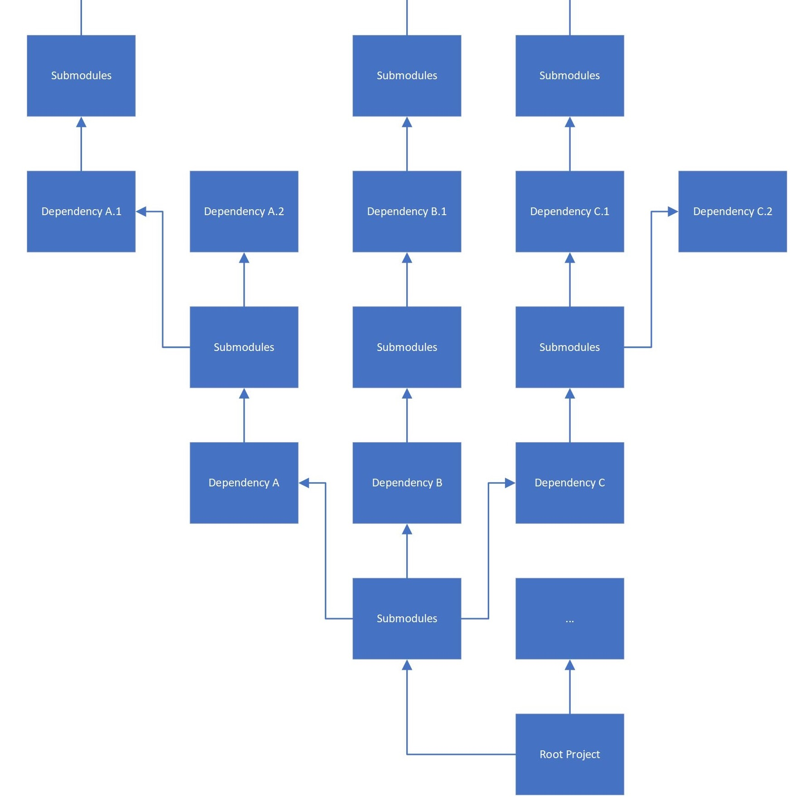
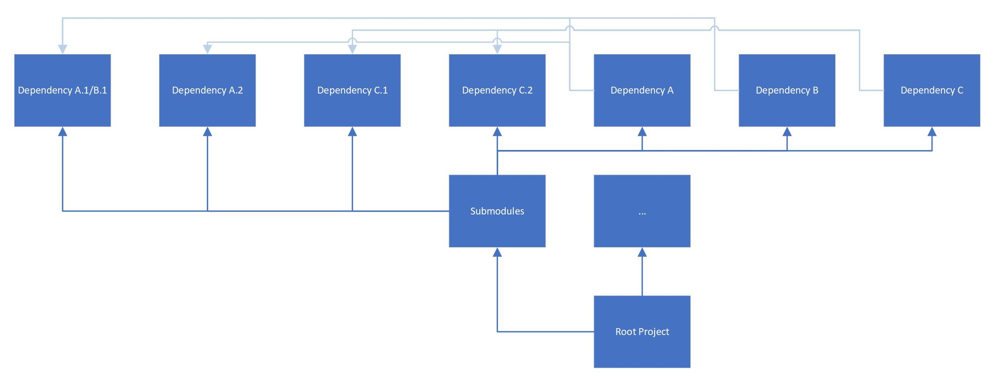

# The Babylon Native Build System

The Babylon Native build system is founded on a lateral dependency management strategy 
implemented using Git Submodules and CMake build targets. This system is designed to be
as extensible and flexible as possible: it should be easy to add new features/extensions,
and it should be easy to incorporate Babylon Native into other existing projects. This 
document provides an overview of the concepts underpinning the Babylon Native build system
and outlines some of the reasoning and intent behind them.

## Lateral Dependency Management

Scalable dependency management can be a challenge when making heavy use of Git Submodules.
The Babylon Native build system addresses this challenge using a strategy we've informally
described as *lateral dependency management*. To explain what this is and the motivation
behind it, we'll begin by exploring some of the problems this strategy attempts to solve.

One of the biggest challenges of dependency management with Git Submodules is that, when 
creating submodules in isolation, efforts to make each repository self-contained often 
lead to submodules bringing along their own dependencies, often as other submodules, 
resulting in a submodule "tree" that can rapidly become unwieldy. For the purposes of 
this discussion, we'll call this approach *vertical dependency management*.

As illustrated in the diagram above, vertical dependency management can result in rather
clunky and confusing repository structures that do not scale very well as the number of 
dependencies grows. More problematic, however, is the difficulty that arises if two or more
"first tier" dependencies actually share a dependency of their own, or if they depend on 
each other. For example, consider what would happen if `Dependency A.1` and `Dependency B.1`
were actually the same library. Because `Dependency A` and `Dependency B` were developed
as independent standalone repositories, they each "bring along" their own copy of the 
shared dependency (and might even bring along different versions), causing that dependency 
to essentially be incorporated twice into `Root Project`, which will cause problems.

The Babylon Native build system's strategy of *lateral dependency management* was 
principally created to avoid this "shared dependency" problem. Instead of a nested, vertical
approach where every submodule is a standalone repository that "brings along" everything it
needs, submodules are instead intended to *not* bring their own dependencies with them. 
Instead, all submodules are added to the `Root Project` directly, making it the top-level 
repository's responsibility to ensure that all dependencies (and their dependencies, and so
on) are provided for.

The "greyed out" dependency arrows in the above diagram allude to the indirect manner by
which submodules depend upon each other: dependency relationships are controlled by CMake
target name, not by repository location. For example, `Dependency A.2` might expose a 
CMake library target called `dependency-a-2`, which the `Dependency A` submodule would
then attempt to link to by name. A more detailed description of this is provided in a 
[later section](#connecting-it-all-with-cmake).

This approach has several advantages when contrasted with vertical dependency management.

- The structure of the project is dramatically simplified.
- It is now possible for multiple submodules to share a dependency without including 
redundant copies of the dependency.
- The root-level repository now has substantially more control. Because the `Root Project`
is now responsible for satisfying *all* dependencies, including dependencies of 
dependencies, it is now in a position to make arbitration decisions about what gets included
and at what version. For example, in the diagram above, both `Dependency A` and 
`Dependency B` depend on `Dependency A.1/B.1`; but because they now only attempt to link to 
their dependencies by name (in this case, perhaps `Dependency A.1/B.1` exposes a target 
called `dependency-x-1`), the submodules are no longer tightly coupled to a particular 
version of their dependency. `Dependency A` and `Dependency B` might have been developed 
against slightly different but API-compatible versions of `Dependency A.1/B.1`. While this 
would have been a problem with vertical dependency management, lateral dependency 
management allows the `Root Project` to arbitrarily decide that the more recent of these 
versions (or even a different API-compatible version) is the right one for `Root Project`'s 
use case; and because the provided version still exposes the `dependency-x-1` target, both 
`Dependency A` and `Dependency B` will automatically link to it by name without requiring 
any modification to the submodules themselves. `Root Project` could even choose to 
"polyfill" the depency with an entirely different API-compatible implementation, and as 
long as that implementation was exposed under the expected target name, `Dependency A` and 
`Dependency B` would correctly link to it and the build would "just work."

These advantages come at the cost of a small number of corresponding disadvantages and 
"quirks."

- Because they no longer "bring along" everything they need, submodules designed to be used 
in a lateral dependency management scenario cannot be thought of as stand-alone libraries. 
This problem can be mitigated by pairing each repository of this kind with a default 
"harness" repository which consumes it as a submodule, laterally supplies its dependencies, 
and allows the building of a stand-alone library.
- Many existing repositories follow patterns more reminiscent of vertical dependency 
management and so do not fit perfectly into a lateral dependency management strategy. This
is usually not a problem; the vertically-dependent submodule can simply be treated as a 
"leaf" dependency with no dependencies of its own, thus allowing the submodule's internal
vertical dependency management to exist "inside" the encompassing lateral dependency 
management mechanism. Note that this will not work if more than one submodule employs this
stragety to import the same shared dependency, as described above. However, if this 
happens, then the two or more dependencies in question are fundamentally incompatible as 
submodules; the problem cannot be solved by either lateral or vertical dependency 
management, and it is likely that another approach, such as the modification of one or more
of the repositories, will be necessary in order to allow these submodules to work together.
- Making the `Root Project` responsible for the satisfaction of *all* dependencies
makes each dependency submodule less of a "black box" because the `Root Project` must now
know about the submodule's dependencies so that it can supply them. In practice, this tends 
to be a small cost, as adding additional submodules is not difficult and makes the 
repository no more heavyweight than it would be otherwise. Still, with regards to the 
encapsulation of information and the hiding of implementation details, it is a disadvantage
or "quirk" worth noting.

In summary, lateral dependency management allows the dependency structure of a repository
to scale *out* instead of *up*. It does this by treating submodule dependencies not as 
independent, self-contained libraries, but as modular components intended to function as 
part of an assemblage, the implementation of which is the responsibility of the root-level
repository. The following sections describe how this idea is implemented within the 
Babylon Native build system.

## Babylon Native Components

As a concept, lateral dependency management lends itself particularly well to highly
moduler, componentized architectures. The Babylon Native build system is designed to 
leverage this strength, providing virtually all of its capabilities as modular components
that can be assembled, recombined, excluded, and/or replaced with relative ease. These
components fall into four principle categories, which are reflected in the top-level
structure of the repository.

- [**`Dependencies`**](https://github.com/BabylonJS/BabylonNative/tree/master/Dependencies): 
As mentioned in a prior section, it is not always possible to get every dependency to 
conform to the laterally-focused patterns used in Babylon Native, particularly when the 
dependency is on external and/or pre-existing code. Dependencies of this description are
contained in the `Dependencies` folder, along with "adapter" mechanisms to allow the
dependency to be consumed by other components that do follow the lateral dependency
management pattern. An example of this can be seen in the 
[adapter code for `base-n`](https://github.com/BabylonJS/BabylonNative/blob/345d5bbffc8245f41d4fbd23efc13c0161b15244/Dependencies/CMakeLists.txt#L14-L17); 
because the `base-n` dependency does not provide a CMake target for other components to 
link to by name, we simply add one for it from outside the submodule so that this name
can be consumed by other components like the 
[`Window` polyfill](https://github.com/BabylonJS/BabylonNative/blob/74878d6ce9f3568b334029094fe100aa8834eca0/Polyfills/Window/CMakeLists.txt#L13).
- [**`Core`**](https://github.com/BabylonJS/BabylonNative/tree/master/Core): Components in
the `Core` folder are the most foundational of all Babylon Native components. The most 
prominent among these is 
[`JsRuntime`](https://github.com/BabylonJS/BabylonNative/tree/master/Core/JsRuntime), 
which is unique in its centrality (nearly every other Babylon Native component is expected 
to depend on it), but other miscellaneous fundamental components also reside within this 
folder. `Core` components have two distinguishing characteristics: (1) they must be 
extremely fundamental Babylon Native components with no dependencies outside the `Core` and 
`Dependencies` folders; and (2) **their primary focus should be to expose functionality to 
the native (C++) layer**. `JsRuntime` is the archetypical `Core` component: it is 
foundational, it has few dependencies, and it provides the primary mechanism with which 
other C++ components can interact with the JavaScript layer.
- [**`Plugins`**](https://github.com/BabylonJS/BabylonNative/tree/master/Plugins): Components
in the `Plugins` folder differ from those in `Core` on both of the latter group's 
distinguishing axes. Firstly, `Plugins` are not expected to be foundational and can have 
many dependencies on other components from the `Plugins`, `Core`, and `Dependencies` 
folders. More importantly, however, `Plugins` differ from `Core` components in that 
**their primary focus should be to expose functionality to the JavaScript layer**. 
Often, but not always, `Plugins` expose functionality by exposing *new types* to 
JavaScript; it is common (though not  required) for these new types to be implemented as C++
types exposed to JavaScript through `N-API`. 
[`NativeEngine`](https://github.com/BabylonJS/BabylonNative/tree/master/Plugins/NativeEngine)
is by far the most important and sophisticated `Plugins` component provided by the Babylon 
Native repository.
- [**`Polyfills`**](https://github.com/BabylonJS/BabylonNative/tree/master/Polyfills): 
As the name implies, components in the `Polyfills` folder exist to "polyfill" common 
capabilities needed by JavaScript libraries.
[`Console`](https://github.com/BabylonJS/BabylonNative/tree/master/Polyfills/Console), for
example, polyfills the `console.log()` capability frequently used in JavaScript. Because 
they have few dependency constraints and are intended to expose functionality to
JavaScript, `Polyfills` are very similar to `Plugins`, but with two important differences.
Firstly, whereas `Plugins` often expose functionality by exposing *new* JavaScript types, 
**`Polyfills` *must* expose their functionality by providing implementations for 
well-known, pre-existing JavaScript capabilities** such as browser features. Secondly,
whereas `Plugins` can be a dependency for another component and can even depend on other
`Plugins`, **no Babylon Native component can ever depend on a `Polyfill`**. Note that this
second restriction does not extend into JavaScript; the fact that the capability is 
polyfilled is an implementation detail of the native layer and should not affect 
implementations in JavaScript. Only native, C++ components are explicitly disallowed from
depending on `Polyfills`.

Babylon Native components from all four of these categories are all intended to be combined 
and reassembled in different ways for different projects. They are also all designed to 
follow the same lateral dependency management pattern 
[described in more detail below](#connecting-it-all-with-cmake). (The exception, of 
course, is the `Dependencies` folder, where there are a number of external dependencies 
that do not conform to Babylon Native's conventions.) For this reason, every Babylon Native 
component can be thought of "philosophically" as a Git submodule. Note that not every 
component actually *is* a submodule; so far, we have not found it worthwhile to carry the 
concept to that extreme since most of the provided components are lightweight and/or 
co-occur in almost every consumption scenario. However, every Babylon Native component 
*could* be separated out into its own repository; its place in the Babylon Native repo 
would subsequently be filled by the new repository as a submodule. This idea -- that 
components are submodules, in concept even when not in fact -- is the cornerstone principle 
of Babylon Native's lateral dependency management architecture. The benefits of this 
architecture are explored further in the documentation on 
[extending Babylon Native](Extending.md).

## Connecting It All With CMake

The implementation of the Babylon Native build system is based on the use of CMake targets
to allow the lateral dependency management strategy described above to function. The 
high-level workflow of the build is to process all the component folders -- `Dependencies`,
`Core`, `Plugins`, and `Polyfills`, respectively -- in order to "discover" all the CMake
targets, which become addressable by name as they are "discovered." Finally, the `Apps` 
folder is processed, whereupon the provided demo applications (notably the 
[Playground](https://github.com/BabylonJS/BabylonNative/tree/master/Apps/Playground))
assemble their dependencies with a small amount of 
[glue code](https://github.com/BabylonJS/BabylonNative/blob/74878d6ce9f3568b334029094fe100aa8834eca0/Apps/Playground/Win32/App.cpp#L96-L120)
into the final executable program.

This build process, in which different side-by-side folders are processed in order to 
"discover" the CMake targets they expose, can be thought as a sort of metaphorical 
craftsman's table on which we will try to make our app. When we begin, there is nothing
on our craftsman's table; we have no tools yet, so we can only process things that have
no dependencies. In the example from the diagram near the beginning of this document, 
the components that have no dependencies are `Dependency A.1/B.1`, `Dependency A.2`, 
`Dependency C.1`, and `Dependency C.2`. Because these do not depend on each other, the
order in which they are processed does not matter, so we arbitrarily choose to process
them in the order listed. As each of these folders is processed, it "leaves behind" the 
named CMake target(s) it exposes: `dependency-x-1`, `dependency-a-2`, and so on. Each of
these named targets can be thought of as a new tool which has been put on our metaphorical
craftsman's table; and now that we have these tools, we can use them to make *more* tools: 
`Dependency A`, `Dependency B`, `Dependency C`, and finally the `Root Project` itself.

As this metaphor illustrates, the relative locations of the different components used in a
build do not matter because components never interact with each other directly. This system
is also indifferent to version numbers and even API-compatible implementation 
substitutions. The only requirement in order for a build such as this to succeed is that,
at the time a component is "put on the table" to be processed, all the tools (CMake target
names) on which it depends must already be available. Consequently, the implementation of
the Babylon Native build system must simply enforce (1) that all the required dependencies
are available and (2) that they are processed in the correct order.

Because order matters, the order in which the component folders are processed also enforces
constraints on the dependencies of the various components. No component can depend on 
another component which is processed after it. Consequently, `Dependencies` can only
depend on other `Dependencies`; `Core` components can depend on other `Core` components as
well as `Dependencies`; `Plugins` can depend on components in `Plugins`, `Core`, or 
`Dependencies`; and `Polyfills` can depend on components in any of they other three 
folders. (Theoretically, `Polyfills` could also take a dependency on other `Polyfills`,
but as was described above, natively depending on a polyfill is not allowed.) Note
that this build system is incapable of describing a circular dependency.

In summary, the Babylon Native build system functions by traversing a laterally organized
list of components grouped into component folders distinguished by category: 
`Dependencies`, `Core`, `Plugins`, and `Polyfills`. The build invokes each of these folders
in turn. Each component folder contains its own `CMakeLists.txt` which determines the order
in which components are processed. (In the case of `Dependencies`, this `CMakeLists.txt` 
also provides adaptation mechanisms for some external libraries.) This causes the build
to invoke each of the components in turn. Each component contains a `CMakeLists.txt` that
provides for its own build instructions, links to its dependencies by name, and exposes
its own named CMake target to be linked to by other components or applications later in 
the build. In this way, the list of available CMake targets grows over time as the build
traverses the list of components from beginning to end. Finally, when all components have
been processed, the build system invokes the `Apps` folder, which creates the final targets
that consume and assemble the various Babylon Native components to build the final
executable program.

This concludes the description of how the Babylon Native build system works within itself.
For further discussion of how this can be modified, extended, or externally consumed,
please refer to the documentation page about 
[Extending Babylon Native](Extending.md).
