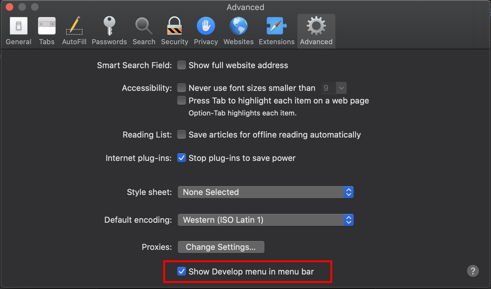
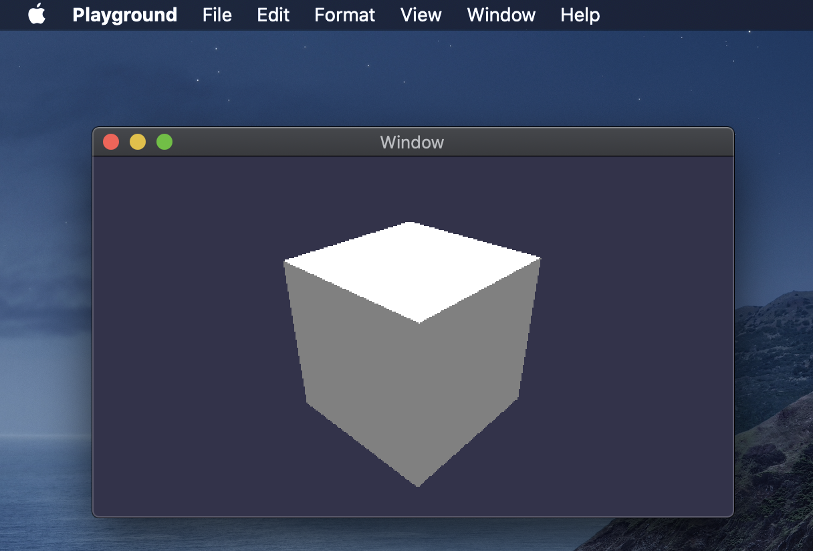
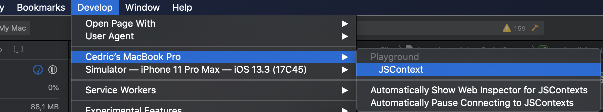

You can debug your Javascript program running in BabylonNative for MacOS or iOS using Safari. These simple steps will show you how you can hook the Safari debugger to your Javascriptcore Context.

# Enable Developer options in Safari

Run Safari, got to the preferences:

Click the Advanced tab and enable developer options

# Hooking Javascriptcore Context

Run your playground.

In Safari, in the develop menu, you should see your app and the context.

Check everything is properly connected by break the app in the debugger. You should see your scripts and all the details.

