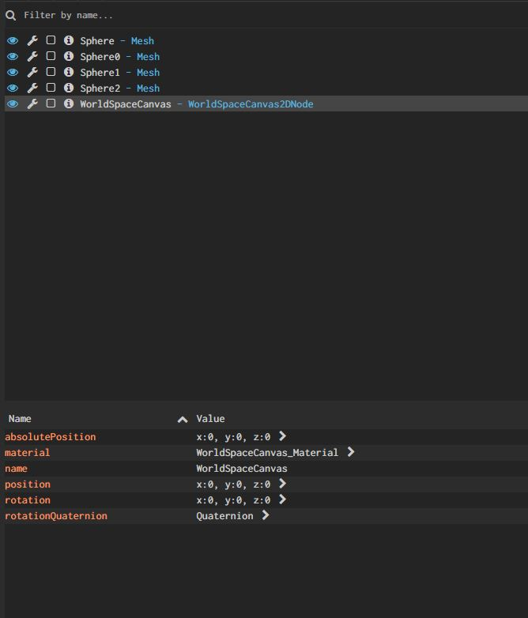
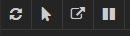

# Babylon.js Inspector

An extension to easily debug your Babylon.js application, made with HTML/CSS.
This extension replaces the old limited debug layer.

## Usage
### Online method
Call the method `show` of the scene debugLayer: 
```
scene.debugLayer.show();
```
This method will retrieve dynamically the library `inspector.js`, download it and add
it to the html page.

### Offline method
If you don't have access to internet, the inspector should be imported manually in your HTML page :
```
<script src="babylon.inspector.js" />
``` 
Then, call the method `show` of the scene debugLayer: 
```
scene.debugLayer.show();
```

A right panel will be created containing the Babylon.js inspector.

## Features

The inspector is composed of a set of tabs (Scene, Shader, Mesh...), each one dedicated to a part of 
the engine. Several tools are also available for specific actions.

##Tabs 



Tabs are separated in two parts (although some are very specific - `Shader` for example): 
* a tree panel, presenting a list of object relative to the current tab (meshes, materials...)
* a properties panel, presenting the list of properties of the selected object

The properties panel is refreshed *almost* in real time (actually each 250ms), 
and can also be updated manually by clicking on a value and pressing `enter`.

For some tabs, a search bar is also available to look for a specific object.

There are currently 5 tabs: 
* `Scene`: displays several properties of the class `BABYLON.Scene`, and provides checkbox to 
manipulate some options (like the old debug layer)
* `Mesh` : displays the list of all meshes in the current scene. 
* `Light`: displays the list of all lights in the current scene. 
* `Shader` : displays the list of custom shaders of the scene. For each shader, the vertex shader and fragment shader is displayed.
* `Canvas2D` : displays the list of all instances of Canvas2D for the current scene. The parent-children hierarchy is represented in the tree.
* `Material` : displays the list of all material in the current scene (keep in mind that every property is updated every 250ms.)

Some properties (like colors, texture...) can display 
### Tools


Several tools are available (from left to right) : 
* Refresh - the current tab is refreshed with the last version of the list of objects
* Pointer - select a mesh in the scene and display its properties in the `Mesh` tab.
* Popup - Undock the inspector into a separate window.
* Pause - Pause the automatic update of properties, allowing to manually update one.

## Contribute

From the tools/gulp folder:
```
npm install
gulp inspector
```


