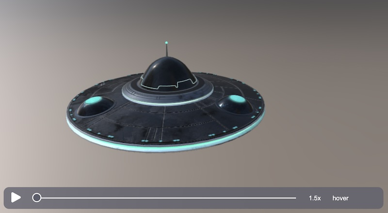
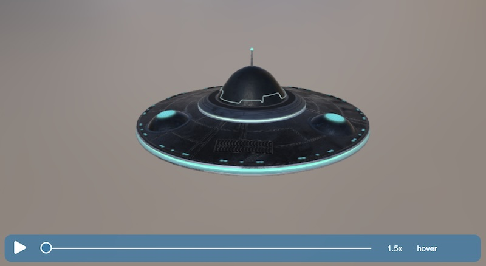
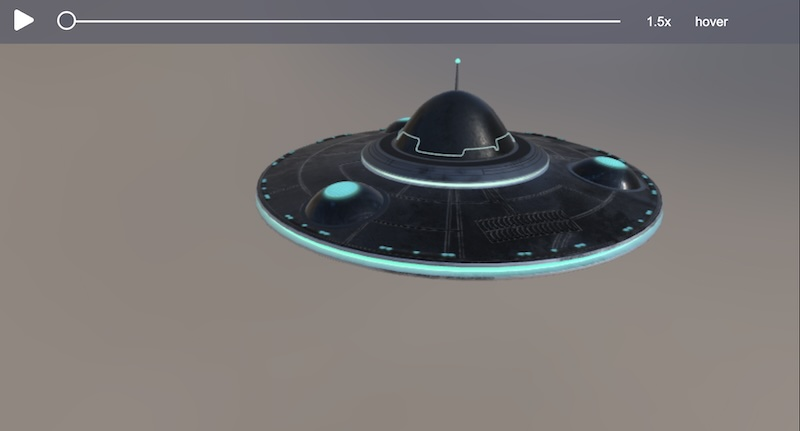
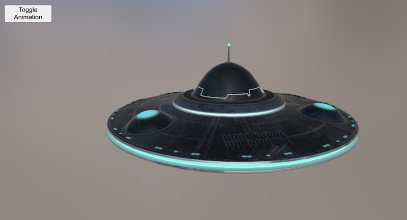

# BabylonJS Viewer

The Babylon Viewer aims to simplify a specific but common Babylon.js use case: loading, viewing, and interacting with a 3D model.



`Viewer` is a lower level JavaScript class that implements the bulk of the features, and can be used in any babylonjs context (in the browser using pure HTML, in the browser using React, or even in Babylon Native).

`HTML3DElement` is a custom HTML element that wraps the `Viewer` class and provides a declarative way to use it specifically in HTML via the custom element `<babylon-viewer>`.

## Using with a Bundler

Install the package using npm:

```bash
npm install @babylonjs/viewer@preview --save
```

If you want to use the lower level `Viewer` directly in JavaScript code, you can import it and use it like this:

```bash
import { Engine } from '@babylonjs/core';
import { Viewer } from '@babylonjs/viewer';

const engine = new Engine(canvas);
const viewer = new Viewer(engine);
viewer.loadModel("https://playground.babylonjs.com/scenes/BoomBox.glb");
```

To use the higher level `HTML3DElement` you can import the `@babylonjs/viewer` module and then reference the `<babylon-viewer>` element in your HTML like this:

```html
<html lang="en">
  <body>
    <!-- If you already import @babylonjs/viewer somewhere in your JavaScript, you don't need this script import. -->
    <script type="module">
      import '@babylonjs/viewer';
    </script>
    <babylon-viewer source="https://playground.babylonjs.com/scenes/BoomBox.glb"></babylon-viewer>
  </body>
</html>
```

## Using Directly in a Browser

If you want to use the viewer directly in a browser without any build tools, you can use the self-contained ESM bundle (which includes all dependencies) through a CDN such as [UNPKG](https://unpkg.com/) or [jsDelivr](https://www.jsdelivr.com/) like this:

```html
<html lang="en">
  <body>
    <script type="module" src="https://unpkg.com/@babylonjs/viewer@preview/dist/babylon-viewer.esm.min.js"></script>
    <babylon-viewer source="https://playground.babylonjs.com/scenes/BoomBox.glb"></babylon-viewer>
  </body>
</html>
```

See the [codesandbox.io](https://codesandbox.io/p/sandbox/babylon-viewer-ws82xr) example for a live demo.

## Features

The Babylon Viewer is under active development and new features are continuously being added. You can request a specific feature in the [Babylon Forum](https://forum.babylonjs.com/c/features/11).

**⚠️ NOTE**: While the Babylon Viewer is production ready in terms of performance, reliability, etc., the `@preview` tag and `-alpha` suffix are used to indicate that the API is still subject to change.

### Formats, Capabilities, and Dynamic Imports

The Babylon Viewer supports all the formats that Babylon.js supports, as well as many capabilities such as animation and audio. However, the Babylon Viewer (with support from various Babylon.js libraries) uses dynamic imports to defer loading formats and capabilities until a model is loaded of a specific type or that uses a specific capability. This reduces the download burden on the end user and reduces the time to get something on the screen.

### Advanced Usage and Customization

While the Babylon Viewer is specifically designed to make viewing a single 3D model easy, it also exposes the underlying Babylon.js components so that you can customize it for your specific scenario and needs.

The `HTML3DElement` exposes a `viewerDetails` property and a `viewerready` event that you can use to access the underlying `Viewer` object, the `Scene` object, and the loaded model (`AssetContainer`).

### WebGL and WebGPU

`HTML3DElement` will choose an underlying engine by default, and how it chooses will change over time. You can use the `engine` attribute to specify a specific engine, such as `WebGL` or `WebGPU`.

### Lighting / Environment

A Babylon.js environment file can be applied to the a `<babylon-viewer>` through the `environment` attribute. For example:

```html
<babylon-viewer
  source="https://playground.babylonjs.com/scenes/BoomBox.glb"
  environment="https://unpkg.com/@babylonjs/viewer@preview/assets/photoStudio.env">
</babylon-viewer>
```

The environment is automatically used as the skybox, and also used for image-based lighting (IBL) when a model is loaded that uses PBR materials (such as glTF), unless the model provides its own lights. When IBL is not used and the model does not provide its own lights, default lighting is applied using Babylon.js lights.

### Styling

`HTML3DElement` includes default UI for various capabilities, such as animation. You can customize the UI in a number of ways:

#### CSS Variables

Various CSS variables can be set to customize the appearance of the viewer. These variables are applied to the `babylon-viewer` element and are inherited by all UI elements within the viewer.

| Variable                      | Description                                                                                                                                 |
| ----------------------------- | ------------------------------------------------------------------------------------------------------------------------------------------- |
| `--ui-foreground-color`       | The default color for the foreground of all UI elements.                                                                                    |
| `--ui-background-hue`         | The default hue for the background of all UI elements.                                                                                      |
| `--ui-background-saturation`  | The default saturation for the background of all UI elements.                                                                               |
| `--ui-background-lightness`   | The default lightness for the background of all UI elements.                                                                                |
| `--ui-background-opacity`     | The default opacity for the background of all UI elements.                                                                                  |
| `--ui-background-color`       | The default color for the background of all UI elements (derived from the background hue, saturation, lightness, and opacity).              |
| `--ui-background-color-hover` | The default color for the background of all UI elements when hovered (derived from the background hue, saturation, lightness, and opacity). |

As an example, if you wanted UI elements with a moderately saturated bluish background, you could apply the following CSS variables on the `babylon-viewer` element:

```css
babylon-viewer {
  --ui-background-hue: 200;
  --ui-background-saturation: 70%;
}
```



#### Parts

Various parts of the viewer can be styled using CSS part selectors. The following parts are available:

| Part Name  | Description                              |
| ---------- | ---------------------------------------- |
| `tool-bar` | The toolbar used for animation controls. |

As an example, if you wanted to style the toolbar to move it to the top and remove the rounded corners and margin, you could apply the following CSS on the `babylon-viewer` element:

```css
babylon-viewer::part(tool-bar) {
  border-radius: 0;
  left: 0;
  right: 0;
  bottom: unset;
  top: 0;
  width: unset;
  max-width: unset;
  transform: unset;
}
```



#### Slots

Various slots are defined that allow entire sections of the UI to be replaced. The following slots are available:

| Slot Name  | Description                              |
| ---------- | ---------------------------------------- |
| `tool-bar` | The toolbar used for animation controls. |

As an example, if you wanted to replace the toolbar with a custom button that just toggles animation play/pause state, you could do so with the following:

```html
<babylon-viewer source="https://raw.githubusercontent.com/BabylonJS/Assets/master/meshes/ufo.glb">
  <div slot="tool-bar" style="position: absolute; top: 12px; left: 12px; width: 100px; height: 36px">
    <button onclick="document.querySelector('babylon-viewer').toggleAnimation()">Toggle Animation</button>
  </div>
</babylon-viewer>
```


